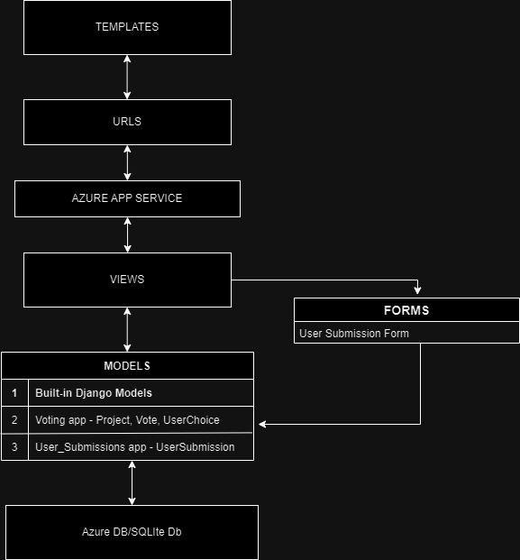

# City Voting Platform

## About
"City Voting Platform" is a website designed to empower citizens by allowing them to vote for various projects across different districts of the city. Using this app, users can vote for existing projects, propose new ideas, and engage in discussions with other members of the community.

## Author
Nikita Pashchuk
- Email: pashchuknik@gmail.com
- Telegram: https://t.me/TakTakYa

## Getting Started:
To run the project, follow next steps:

1. Clone the repository: git clone https://github.com/NikitaPash/Pashchuk.University.CityVotingPlatform.git
2. Install dependencies: pip install -r requirements.txt
3. Run the development server: python manage.py runserver

## Documentation
### Introduction
City Voting Platform is the best decision for government of a small city to connect with society in order to create better place for all to live in. Using user-friendly interface and a variety of instruments people can vote for different city projects, communicate with each other and much more!

### Features
- User Authentication with Google account.
- Welcome Email upon registration.
- Project Voting System.
- Proposal Submission.
- Commenting system.
- User Profile Management.
- Interactive Map Interface.
- District Information.
- Notification System.
- Admin Panel.
- Analytics Dashboard.
- Help and Support.

### Architecture
The City Voting Platform app follows a client-server architecture. The client-side is built using HTML, CSS, and JS, while the server-side is implemented with Django.
 

### Usage
To become a part of city's community, simply register or sign in with your Google account. Then, you can access different projects, choose the most interesting ones and help them to become a reality.

## Project Task Decomposition
Week 1 (02/27 - 03/06):
1. Implement feature: User Registration with Google Account ✔️
2. Set up Azure environment for deployment ✔️
3. Create Azure deployment pipelines ✔️
4. Write Getting Started documentation ✔️
5. Set up project repository on GitHub ✔️

Week 2 (03/06 - 03/13):
1. Implement feature: Welcome Email upon registration ✔️
2. Develop interactive map interface ✔️
3. Configure user authentication using OAuth 2.0 ✔️
4. Write initial project documentation ✔️
5. Set up Continuous Integration/Continuous Delivery (CI/CD) pipeline ✔️

Week 3 (03/13 - 03/20):
1. Implement feature: Project Voting functionality ✔️
2. Design database schema for projects and user data ✔️
3. Implement backend services for project management ✔️
4. Write unit tests for authentication and project services ✔️
5. Refine CI/CD pipeline for automated testing ✔️

Week 4 (03/20 - 03/27):
1. Implement feature: Proposal Submission ✔️
2. Develop project view functionality ✔️
3. Design frontend components for user interaction ✔️
4. Perform integration testing for user authentication and project functionalities ✔️
5. Update project documentation with architecture diagram ✔️

Week 5 (03/27 - 04/03):
1. Implement feature: Commenting System ✔️
2. Develop backend logic for commenting ✔️
3. Design UI for commenting feature ✔️
4. Integrate commenting system with existing project views ✔️
5. Test commenting system for functionality and performance ✔️

Week 6 (04/03 - 04/10):
1. Implement feature: User Profile Management ✔️
2. Develop user profile CRUD operations ✔️
3. Design user profile UI components ✔️
4. Integrate user profile management with authentication system ✔️
5. Test user profile functionality and UI interactions ✔️

Week 7 (04/10 - 04/17):
1. Implement feature: Interactive Map Interface ✔️
2. Integrate map API for district visualization ✔️
3. Develop UI components for interactive map ✔️
4. Implement functionality for highlighting projects on the map ✔️
5. Test map interface for usability and performance ✔️

Week 8 (04/17 - 04/24):
1. Implement feature: District Information ✔️
2. Design database schema for district data ✔️
3. Develop backend services for fetching district information ✔️
4. Design UI components for displaying district details ✔️
5. Integrate district information with interactive map interface ✔️

Week 9 (04/24 - 05/01):
1. Implement feature: Notification System ✔️
2. Develop backend logic for sending notifications ✔️
3. Design UI for notification display ✔️
4. Integrate notification system with user profiles ✔️
5. Test notification delivery and user interaction ✔️

Week 10 (05/01 - 05/08):
1. Implement feature: Admin Panel ✔️
2. Design admin dashboard UI ✔️
3. Develop backend services for admin functionalities ✔️
4. Implement user management features for admins ✔️
5. Test admin panel for security and functionality ✔️

Week 11 (05/08 - 05/15):
1. Implement feature: Analytics Dashboard ✔️
2. Design database schema for analytics data ✔️
3. Develop backend services for analytics processing ✔️
4. Design UI components for displaying analytics insights ✔️
5. Integrate analytics dashboard with voting and project data ✔️

Week 12 (05/15 - 05/22):
1. Implement feature: Help and Support ✔️
2. Develop help documentation pages ✔️
3. Design UI for accessing help resources ✔️
4. Implement support ticket system ✔️
5. Test help and support features for accessibility and usability ✔️

## Anti-Lab 2
- Kondratska
- [My project](https://github.com/gearbeagel/Kondratska.University.AirplaneLearning)
- [My fork](https://github.com/gearbeagel/Pashchuk.University.CityVotingPlatform)